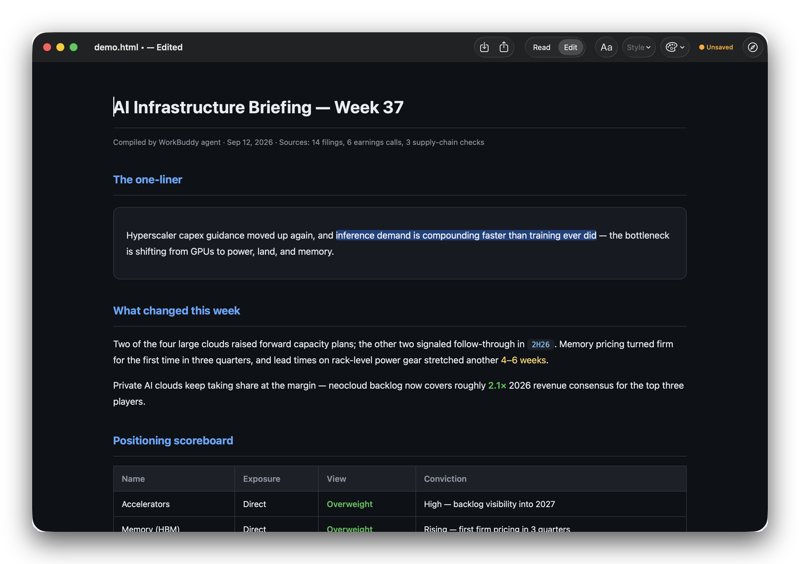

# Pree HTML Station

**An HTML editor for macOS.**

Open any `.html` file, click and type like a Word document, `⌘S` saves back to the original file. Native Swift + WKWebView, ~2 MB, zero dependencies.



## Install

**One-liner** — downloads the latest release, strips the quarantine flag, installs to /Applications and launches:

```bash
curl -fsSL https://raw.githubusercontent.com/hukairui228/pree-html-station/main/tools/install.sh | bash
```

**Homebrew** (asks you to trust the tap once):

```bash
brew install --cask hukairui228/tap/pree-html-station
```

**Or download** [`PreeHTMLStation-macOS.zip`](https://github.com/hukairui228/pree-html-station/releases/latest) and drag to Applications — since the build is ad-hoc signed, right-click → Open on first launch.

Universal binary (Apple Silicon + Intel), macOS 13+.

## Why

AI agents (Claude, ChatGPT, WorkBuddy, …) now generate a huge amount of standalone HTML — reports, briefings, one-off pages. Tweaking that output by hand has no good tool:

- A full IDE is overkill; browser DevTools isn't an editor
- The classic visual HTML editors (BlueGriffon, KompoZer, Amaya…) are dead or unmaintained
- Web-builder frameworks (GrapesJS etc.) rebuild the DOM and mangle your styles

Pree HTML Station fills exactly this gap: **open → click → fix → save, nothing else.**

## Features

- **Read mode by default** — click around without editing. Links work: same-page anchors scroll, local `.html` links open in-app, external links go to your browser
- **Edit mode (`⌘E` or the Read | Edit toggle)** — click any text and type, like a doc. Bold / italic / underline / strikethrough, H1–H3 & body, 9 font colors
- **`⌘S` saves back to the original file** — atomic write, dirty-state indicator (`● unsaved` / `✓ saved`), close protection
- `⇧⌘S` Save As · `⌃⌘B` auto-save then open in browser · `⌘R` reload
- Open via `⌘O`, drag & drop onto the window, or **Open With** from Finder
- Dark UI. Single ~2 MB `.app`, no runtime dependencies, works offline

## Build

Requires macOS 13+ and Xcode Command Line Tools (`xcode-select --install`).

```bash
git clone https://github.com/hukairui228/pree-html-station.git
cd pree-html-station
./tools/build_app.sh
```

Produces a self-signed `Pree HTML Station.app` (rename freely). One-liner, no script:

```bash
swiftc -O -framework Cocoa -framework WebKit tools/host/main.swift -o PreeHTMLStation
```

> The build is not notarized. On first launch: right-click → Open (or System Settings → Privacy & Security → Open Anyway).

## Usage tips

- Set Pree HTML Station as the default editor for `.html` files: Finder → right-click a file → Get Info → Open with → Change All…
- Or drag any `.html` onto the window / Dock icon

## Limitations

- Best for **static** HTML — agent reports, briefings, docs. Pages whose JavaScript re-renders content will fight with editing
- Whole-document editing (designMode): no element-tree inspector, no CSS panel — this is a pen, not an IDE

## Roadmap

- [ ] Find & replace
- [ ] Font size controls
- [ ] Read-mode annotations (highlight + notes, exportable)
- [ ] "Send back to agent" hook — select text, add an instruction, hand it to your agent CLI

## License

[MIT](LICENSE)
